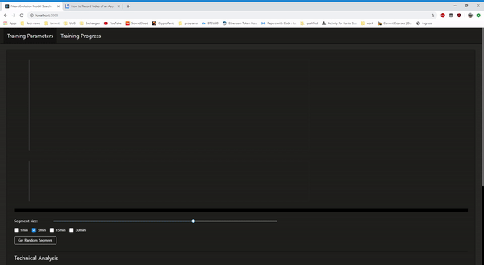

# Tensorflow NeuroEvolution BTC Trader  

Tensorflow is used to build a population of models that breed and mutate iteratively. The initial population is built given a specified network topology and assigned random weights. For each generation, these weights are randomly mutated and each network is assigned a fitness value based on their performance. A pooling algorithm is used to select models for the next generation and the process is repeated. Models with a higher fitness tend to make it to the next generation where their weights are mutated and ideally create a higher performing generation  



---

## Run

Start the python backend then start the React dev server
```
python server.py
npm run start --prefix=interface
```
You can also build the react project and then run _server.py_ (flask will see the static build files)  
```
npm run build --prefix=interface
python server.py
```

## Usage  

Using the trading framework is very easy. All you need to do is select the TA you would like to use and specify the model parameters. This is passed to the Python backend which constructs a population of models with the given parameters. The fitness of each model is used in a pooling algorithm to decide which models to use after each generation. The models are then copied over to the next generation and randomly mutated depending on the selected mutation parameters.  

The interface will show the progress and stats of each generation. It will graph the results of the overall best model and where it traded.  

### Data

The application expects a CSV of OHLC prices in 1-min intervals with column headers in the data folder. The provided data file is data from Coinbase from 2017-2019
The format should be as follows:
```
timestamp,open,high,low,close,volume
2017-01-01 18:52:00,992.83,993.76,992.4,993.4,2.83443
2017-01-01 18:53:00,993.0,993.0,992.51,992.51,0.55261
...
```

### Fitness callback  

A callback function needs to be passed into _pop.run()_ so it can know how to evaluate the network. In a trading environment this is usually the profit the model made.  

```python
def calculate_profit(trades, trade_prices):
    btc_wallet = 0.
    starting_cash = 100.
    usd_wallet = starting_cash
    fee = 0.001

    holding = False
    for idx, trade in enumerate(trades):
        if holding and not np.argmax(trade):
            holding = False
            usd_wallet = btc_wallet * trade_prices[idx] * (1 - fee)
        if not holding and np.argmax(trade):
            holding = True
            btc_wallet = usd_wallet / trade_prices[idx] * (1 - fee)

    return (usd_wallet / starting_cash - 1) * 100
```

---  

### To Do

- create Dockerfile
- allow adjustments to TA periods
- better metrics
